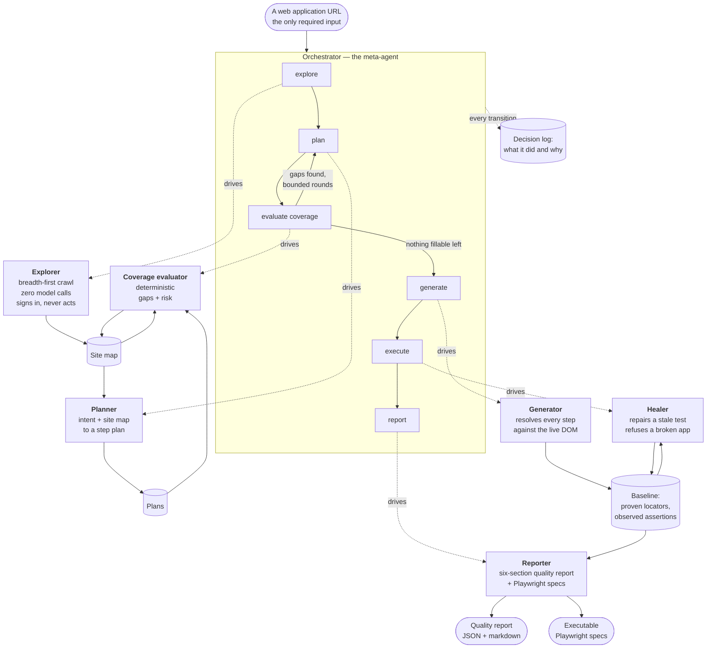
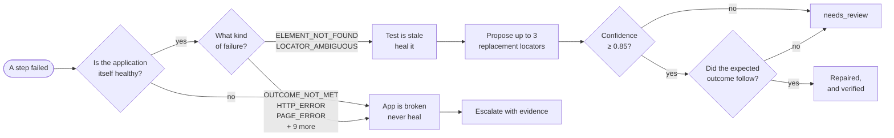
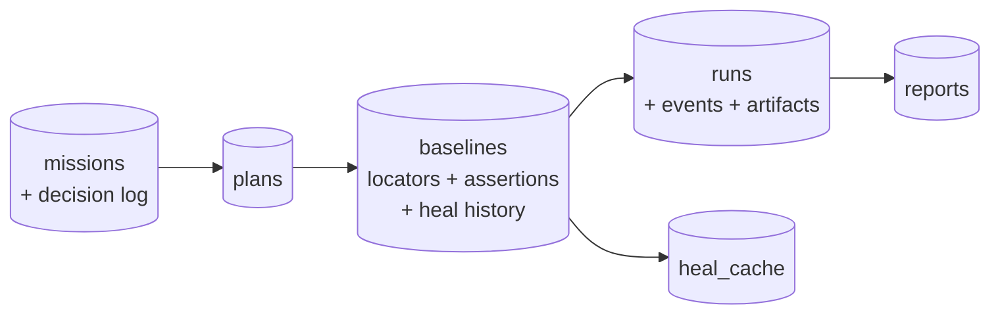

# EdgeForge — architecture

The submission asks for a diagram of the orchestration flow between sub-agents. That
is the first one below. The rest of this document is what a reader needs to judge
whether the flow is real.

---

## The orchestration flow



**The loop is the point.** Coverage is scored between planning and generation, and a
score with fillable gaps sends the orchestrator back to plan again rather than
forward. On the bundled fixture that runs 0.20 → 0.65 → 0.75, taking refusal-path
coverage from 0 of 4 to 4 of 4. The bound exists because a gap can be unfillable — a
form with no submit control will be reported missing every round — and an unbounded
loop would spend the budget rediscovering it.

**Every transition writes a decision.** An orchestrator that runs stages in order is
a shell script; what makes it an agent is being able to say why it moved on, what it
skipped, and on what grounds. Those sentences are the output a reviewer reads.

---

## The decision that shapes everything

Every failure is asked one question: **did we fail to find the element, or fail to get
the expected result?**



Health is classified **before** locator reasoning, so a 500 that empties a page is
never diagnosed as a renamed button. The split is deterministic — membership in a set
of two healable kinds against twelve that are never healable — not a heuristic, and
every classification keeps the health snapshot it was made from, commented in the
source as *"kept so a wrong call can be argued with later."*

**The refusal is the product.** A tool that repairs everything eventually repairs a
test into agreeing with a bug. Healing stops at three repairs in one run, on the
grounds that at that point the interface has changed more than a locator has.

---

## Two properties worth defending

**Replay makes zero model calls.** `src/run/replay.ts` drives the browser
deterministically. Only planning, locator resolution and healing consult a model. A
run is therefore reproducible, and a demo does not depend on a model being available
at the moment somebody presses the button.

**The crawl makes zero model calls either.** Coverage wants exhaustiveness, which a
queue delivers better than judgement, and a crawl spending one call per navigation
decision would exhaust a free-tier daily budget before a single test ran. The model's
contribution is deciding what is worth *testing* about what was found — once per
page, not once per click.

---

## Layout

```
src/
  orchestrator/   the meta-agent: state machine, supervisor, value preflight
  explore/        breadth-first crawl → site map (no model calls)
  coverage/       deterministic gap and risk analysis (no model calls)
  intent/         plan generation, validation, gap-filling prompts
  baseline/       resolves a plan against the live DOM, derives assertions
  browser/        Playwright: extraction, locator resolution, a11y, screenshots
  run/            replay, failure classification, verification
  heal/           repair proposal and verification
  prd/            requirement extraction and coverage mapping
  report/         six-section quality report, JSON and markdown
  emit/           Playwright spec files from proven locators
  capability/     one declaration per operation, with its schema and route
  fixtures/       seven versions of a deliberately fragile app
  store/          SQLite persistence
  server/         HTTP, SSE, queue, static
```

## Data flow through the stores



A mission is one-to-many with plans: the first is the journey it was asked for, the
rest exist because the coverage evaluator found something missing. A plan's baseline
carries its heal history, so the record of why a locator became what it is travels
with the locator rather than sitting in a separate log.

---
